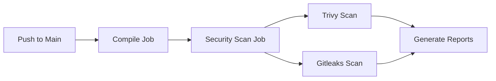

# GitHub Actions CI/CD Pipeline Project

[](https://github.com/divy1436/Github-Actions-Project-main/actions/workflows/cicd2.yml)

A comprehensive Java Maven project demonstrating automated CI/CD pipeline implementation using GitHub Actions with integrated security scanning.

---

## 📋 Table of Contents

- [Overview](#overview)
- [Features](#features)
- [Pipeline Architecture](#pipeline-architecture)
- [Prerequisites](#prerequisites)
- [Getting Started](#getting-started)
- [Pipeline Configuration](#pipeline-configuration)
- [Security Scanning](#security-scanning)
- [Maven Configuration](#maven-configuration)
- [Workflow Stages](#workflow-stages)
- [Usage](#usage)
- [Pipeline Execution](#pipeline-execution)
- [Troubleshooting](#troubleshooting)
- [Contributing](#contributing)
- [License](#license)

---

## 🎯 Overview

This project implements a production-ready CI/CD pipeline using GitHub Actions for Java Maven applications. The pipeline includes automated building, testing, and security vulnerability scanning using industry-standard tools.

### Key Highlights

- ✅ Automated build on every push to main branch
- ✅ Maven dependency caching for faster builds
- ✅ Comprehensive security scanning with Trivy and Gitleaks
- ✅ Parallel job execution with dependency management
- ✅ JSON-formatted security reports

---

## 🚀 Features

- **Automated Compilation**: Java 17 with Maven build automation
- **Security Scanning**: 
  - Trivy for filesystem vulnerability detection
  - Gitleaks for secret leak detection
- **Efficient Caching**: Maven dependency caching
- **Report Generation**: JSON-formatted security scan reports
- **Job Dependencies**: Sequential execution with `needs` keyword

---

## 🏗️ Pipeline Architecture



### Pipeline Flow

![Pipeline Execution Flow]

*Figure 1: Pipeline execution showing compile (7s) → security-scan (1m 10s) stages*

1. **Trigger**: Push to `main` branch
2. **Compile**: Setup JDK 17 and Maven environment
3. **Security Scan**: Run Trivy and Gitleaks scans
4. **Reports**: Generate JSON security reports

**Average Pipeline Duration**: ~1m 21s

---

## 📦 Prerequisites

- Java 17 or higher
- Maven 3.6+
- GitHub account with Actions enabled
- Git installed locally

---

## 🛠️ Getting Started

### 1. Clone the Repository

```bash
git clone https://github.com/divy1436/Github-Actions-Project-main.git
cd Github-Actions-Project-main
```

### 2. Project Structure

```
Github-Actions-Project-main/
├── .github/
│   └── workflows/
│       └── cicd2.yml          # CI/CD pipeline configuration
├── src/
│   ├── main/
│   └── test/
├── pom.xml                     # Maven configuration
└── README.md
```

### 3. Local Setup

```bash
# Build the project
mvn clean install

# Run tests
mvn test

# Package application
mvn package
```

---

## ⚙️ Pipeline Configuration

### Workflow File: `.github/workflows/cicd2.yml`

```yaml
name: CICD2 Pipeline

on:
  push:
    branches: ["main"]

jobs:
  compile:
    runs-on: ubuntu-latest
    steps:
      - uses: actions/checkout@v4
      
      - name: Set up JDK 17
        uses: actions/setup-java@v4
        with:
          java-version: "17"
          distribution: "temurin"
          cache: maven
      
      - name: Build with Maven
        run: mvn clean install -DskipTests
      
      - name: Run Tests
        run: mvn test

  security-scan:
    runs-on: ubuntu-latest
    needs: compile
    steps:
      - uses: actions/checkout@v4
      
      - name: Install Trivy
        run: |
          sudo apt-get update -y
          sudo apt-get install -y wget gnupg
          wget -qO - https://aquasecurity.github.io/trivy-repo/deb/public.key \
            | gpg --dearmor \
            | sudo tee /usr/share/keyrings/trivy.gpg > /dev/null
          echo "deb [signed-by=/usr/share/keyrings/trivy.gpg] https://aquasecurity.github.io/trivy-repo/deb generic main" \
            | sudo tee /etc/apt/sources.list.d/trivy.list
          sudo apt-get update -y
          sudo apt-get install -y trivy
      
      - name: Trivy FS Scan
        run: trivy fs --format json --output trivy-fs-report.json .
      
      - name: Install Gitleaks
        run: sudo apt-get install -y gitleaks
      
      - name: Gitleaks Code Scan
        run: |
          gitleaks detect \
            --source . \
            --report-format json \
            --report-path gitleaks-report.json
```

---

## 🔐 Security Scanning

### Trivy Scanner

**Purpose**: Detects vulnerabilities in dependencies, OS packages, and application libraries

**Features**:
- Comprehensive vulnerability database
- Fast scanning performance
- JSON output for easy integration
- Supports multiple package formats

**Output**: `trivy-fs-report.json`

### Gitleaks Scanner

**Purpose**: Detects hardcoded secrets, API keys, and credentials

**Features**:
- Git history scanning
- Regex-based secret detection
- Custom rule support
- Prevents credential leaks

**Output**: `gitleaks-report.json`

---

## 📊 Maven Configuration

### Essential Maven Commands

| Command | Description |
|---------|-------------|
| `mvn clean` | Remove build artifacts |
| `mvn compile` | Compile source code |
| `mvn test` | Execute unit tests |
| `mvn package` | Create JAR/WAR file |
| `mvn install` | Install to local repository |
| `mvn clean install` | Full build cycle |
| `mvn clean install -DskipTests` | Build without tests |

### Maven Dependency Caching

The pipeline uses Maven caching to speed up builds:

```yaml
- name: Set up JDK 17
  uses: actions/setup-java@v4
  with:
    cache: maven  # Enables dependency caching
```

**Benefits**:
- Faster subsequent builds
- Reduced network usage
- Improved pipeline efficiency

---

## 🔄 Workflow Stages

### Stage 1: Compile (7s)

**Objective**: Set up Java environment and build project

**Steps**:
1. Checkout repository code
2. Set up JDK 17 with Maven cache
3. Build project with Maven
4. Run unit tests

**Runner**: `ubuntu-latest`

### Stage 2: Security Scan (1m 10s)

**Objective**: Perform security vulnerability analysis

**Steps**:
1. Checkout repository code
2. Install Trivy scanner
3. Run filesystem vulnerability scan
4. Install Gitleaks scanner
5. Detect hardcoded secrets

**Runner**: `ubuntu-latest`  
**Dependency**: Requires `compile` job completion

---

## 💻 Usage

### Triggering the Pipeline

The pipeline automatically triggers on:

```yaml
on:
  push:
    branches: ["main"]
```

**Manual Trigger**:
1. Go to "Actions" tab in GitHub
2. Select "CICD2 Pipeline"
3. Click "Run workflow"

### Viewing Results

![GitHub Actions Dashboard]

*Figure 2: Pipeline summary showing successful execution with status, duration, and artifacts*

1. Navigate to your repository
2. Click "Actions" tab
3. Select the workflow run
4. View job logs and artifacts

### Pipeline Execution Details


**Key Information Displayed:**
- Trigger event (push by divy1436)
- Commit hash (170573f)
- Branch (main)
- Total duration (1m 21s)
- Job status indicators

### Accessing Security Reports

Security scan reports are generated but not currently uploaded as artifacts. To access them, add this step:

```yaml
- name: Upload Security Reports
  uses: actions/upload-artifact@v3
  with:
    name: security-reports
    path: |
      trivy-fs-report.json
      gitleaks-report.json
```

---

## 📈 Pipeline Execution

### Workflow Runs History


### Recent Performance Metrics

| Run # | Commit | Branch | Duration | Status | Time |
|-------|--------|--------|----------|--------|------|
| #4 | 170573f | main | 1m 21s | ✅ Success | 4 minutes ago |
| #3 | 4e4f5cc | main | 1m 15s | ✅ Success | 7 minutes ago |
| #2 | ea3a102 | main | 1m 56s | ✅ Success | 9 minutes ago |
| #1 | db28a62 | main | 34s | ✅ Success | 36 minutes ago |

**Author**: divy1436  
**Success Rate**: 100%

### Pipeline Stages Visualization


**Job Execution Flow:**
```
compile (7s) ──────► security-scan (1m 10s)
     ✅                      ✅
```

---

## 🔍 Troubleshooting

### Common Issues and Solutions

#### Issue: Maven Build Fails

**Symptoms**: Build errors, dependency resolution failures

**Solutions**:
```bash
# Clear local Maven cache
rm -rf ~/.m2/repository

# Verify Java version
java -version

# Check pom.xml syntax
mvn validate
```

#### Issue: Security Scan Fails

**Symptoms**: Trivy or Gitleaks installation errors

**Solutions**:
- Check internet connectivity
- Verify GPG keys are correctly added
- Ensure sufficient runner permissions

#### Issue: Pipeline Not Triggering

**Symptoms**: Push to main doesn't trigger workflow

**Solutions**:
- Verify workflow file location: `.github/workflows/cicd2.yml`
- Check YAML syntax validity
- Ensure Actions are enabled in repository settings

#### Issue: Slow Build Times

**Solutions**:
- Verify Maven caching is enabled
- Use `-DskipTests` for faster builds (when appropriate)
- Consider using self-hosted runners

---

## 📊 Monitoring and Metrics

### Pipeline Dashboard

Navigate to the Actions tab to view:
- Real-time execution status
- Historical run data
- Performance trends
- Failure patterns

### Performance Optimization

| Metric | Current | Target | Status |
|--------|---------|--------|--------|
| Average Duration | 1m 21s | <2m | ✅ |
| Success Rate | 100% | >95% | ✅ |
| Compile Time | 7s | <15s | ✅ |
| Security Scan | 1m 10s | <2m | ✅ |

---

## 🤝 Contributing

Contributions are welcome! Please follow these steps:

1. Fork the repository
2. Create a feature branch (`git checkout -b feature/AmazingFeature`)
3. Commit your changes (`git commit -m 'Add some AmazingFeature'`)
4. Push to the branch (`git push origin feature/AmazingFeature`)
5. Open a Pull Request

### Contribution Guidelines

- Follow existing code style
- Add tests for new features
- Update documentation as needed
- Ensure all CI checks pass

---

## 📄 License

This project is licensed under the MIT License - see the [LICENSE](LICENSE) file for details.

---

## 👤 Author

**Divyansh (divy1436)**

- GitHub: [@divy1436](https://github.com/divy1436)

---

## 🙏 Acknowledgments

- [GitHub Actions Documentation](https://docs.github.com/en/actions)
- [Apache Maven](https://maven.apache.org/)
- [Trivy Security Scanner](https://trivy.dev/)
- [Gitleaks](https://github.com/gitleaks/gitleaks)

---

## 📞 Support

If you encounter any issues or have questions:

1. Check the [Troubleshooting](#troubleshooting) section
2. Search existing [Issues](https://github.com/divy1436/Github-Actions-Project-main/issues)
3. Create a new issue with detailed information


---

## 📊 Status


---

**Made with ❤️ using GitHub Actions**

---

## 📸 Screenshots Guide

To add your screenshots to this README, save them in your repository and update the image paths:

1. Create an `assets` or `images` folder in your repository root
2. Save your screenshots there (e.g., `pipeline-execution.png`, `workflow-runs.png`)
3. Replace the placeholder paths in this README:
   - Replace `path/to/image1.png` with `assets/pipeline-execution.png`
   - Replace `path/to/image2.png` with `assets/workflow-runs.png`

**Example**:
```markdown


```
